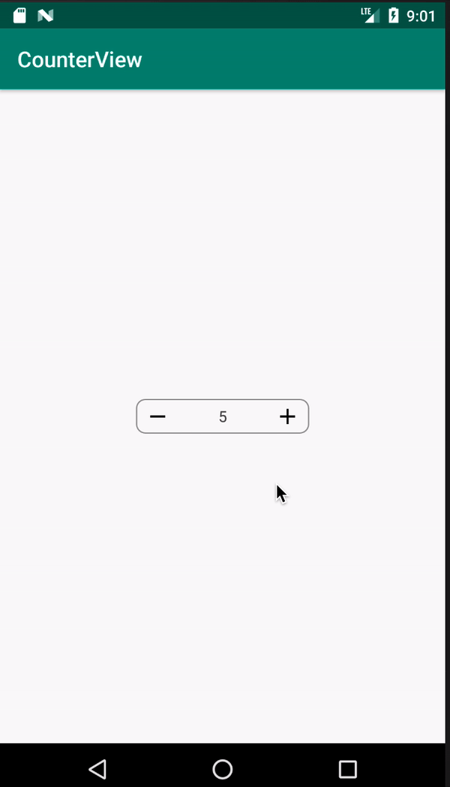

# CounterView

Componente para **Android**, está construido en **Kotlin** <br>
Permite aumentar y disminuir el valor

## Requerimientos

CounterView funciona desde **Android 4+ (API 16+)**<br>
Se recomienda utilizar **Java 8+**

## Implementación

Se debe agregar esta línea en las dependencias de gradle

``` implementation "com.rba.counter.view:counterview:1.0.0" ```

Las versiones disponibles se encuentran [aquí](#)

<p align="center">
  <br>
</p>

## ¿Cómo Usar?

```xml
      <com.rba.counter.view.CounterView
        android:id="@+id/counterView"
        android:layout_width="160dp"
        android:layout_height="32dp"
        app:counter_view_max="20"
        app:counter_view_min="1"
        app:counter_view_up_down_value="1"
        app:counter_view_value="5" />
```
Tiene los siguientes atributos:

<kbd>Agregar valor máximo</kbd>
- Desde XML(counter_view_max): Recibe un valor Integer
- Desde Código(maxValue): Recibe un valor Integer

<kbd>Agregar valor mínimo</kbd>
- Desde XML(counter_view_min): Recibe un valor Integer
- Desde Código(minValue): Recibe un valor Integer

<kbd>Actualizar el valor que subirá/bajará el componente</kbd>
- Desde XML(counter_view_up_down_value): Recibe un valor Integer
- Desde Código(upDownValue): Recibe un valor Integer

<kbd>Actualizar el valor actual</kbd>
- Desde XML(counter_view_value): Recibe un valor Integer
- Desde Código(value): Recibe un valor Integer

## Licencia

Este proyecto es propiedad intelectual de BCP. El uso sin autorización está prohibido. Revise el archivo  [LICENSE]()  para mayor detalles.

<br>
<br>
*Happy coding!*